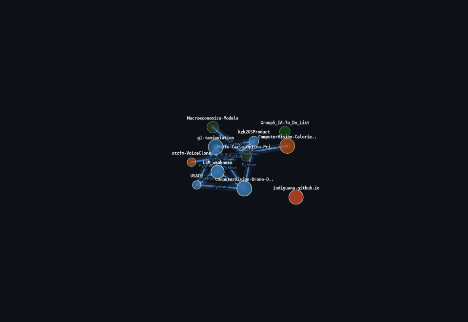

---

**CS and ML researcher at Carnegie Mellon.** Working on LLM security (jailbreak pattern discovery via clustering + neural nets), voice cloning for laryngectomy patients, and computer vision systems. USACO Gold, AIME qualifier, National Merit Finalist.

---

### Tech Stack

---

### Repo Knowledge Graph

> My repositories, connected by shared languages and topics. Regenerated daily.

---

### GitHub Stats

---

### Trophies

---

### Contribution Snake

---

Knowledge graph and snake regenerated daily by GitHub Actions

